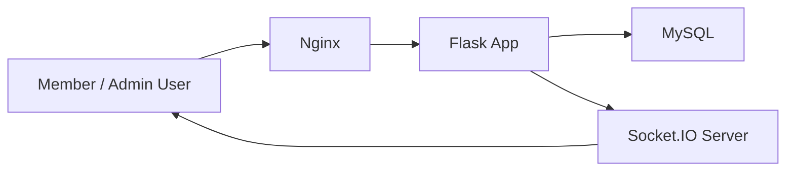

# Sentinel

Sentinel is a role-based realtime messaging demo built to show product thinking, access-control discipline, and production-minded engineering in one portfolio project.


## Why This Project Works In A Portfolio

- It separates member chat access from admin moderation instead of treating "admin" as unlimited access.
- It combines product-facing polish with backend concerns such as CSRF protection, role guards, Docker support, and automated tests.
- It is easy to demo in under two minutes, which matters when HR, recruiters, or hiring managers are skimming many projects quickly.

## Core Features

- Username/email/password authentication with CSRF-protected form handling.
- Role-based routing: members enter the chat workspace while admins enter a dedicated moderation console.
- Real-time member chat powered by Socket.IO.
- Member-only message access: admins cannot read or send chat messages.
- Dedicated admin roster with search, summary metrics, ban, and unban actions.
- React-powered product UI for both member and admin experiences.
- Dockerized local deployment with MySQL and Nginx.
- Automated test coverage for auth, CSRF, admin permissions, and Socket.IO flows.

## Standout Product Features

- Dedicated admin dashboard that makes the privacy boundary visible, not just enforced in code.
- Member-side live typing indicator for a more believable realtime collaboration experience.
- Recent-message search inside the member workspace for quicker demos and better usability.

## Demo Credentials

Fresh database bootstrap credentials:

- Admin username: `admin`
- Admin password: `AdminPass123!`

Regular members can register from the landing page after the app starts.

## Fast Demo Flow

Use this flow when showing the project to HR, recruiters, or interviewers:

1. Open the landing page and explain that members and admins do not share the same workspace.
2. Register or log in as a member and show the live message stream, message search, and typing feedback.
3. Log out and log in as the seeded admin.
4. Show that the admin is redirected into a dedicated moderation console instead of the message workspace.
5. Ban or unban a user and explain that the admin never gets message access.

Full walkthrough: [docs/demo-flow.md](docs/demo-flow.md)

## Tech Stack

- Flask
- Flask-WTF
- Flask-SocketIO
- Flask-MySQLdb
- Flask-Limiter
- React
- Tailwind CSS
- MySQL
- Nginx
- Gunicorn
- Docker Compose
- Pytest

## Local Development

### Option 1: Native Python

```powershell
cd "C:\Users\kvsat\Downloads\secure-messaging-app-main\secure-messaging-app-main"
py -m pip install --user -r requirements-dev.txt
py -m pytest
py app.py
```

The application expects a MySQL database named `secure_panel`. You can use the included `database.sql` to initialize it.

### Option 2: Docker

```powershell
cd "C:\Users\kvsat\Downloads\secure-messaging-app-main\secure-messaging-app-main"
docker compose up --build
```

This starts:

- `web` on internal port `5000`
- `db` using MySQL 8
- `nginx` on port `80`

## Testing

Run the backend and integration tests:

```powershell
py -m pytest
```

Run the browser E2E audit:

```powershell
npm ci
npm run test:e2e
```

CI source of truth:

- `.github/workflows/playwright.yml` runs `python -m pytest` and `npm run test:e2e` on pushes and pull requests.
- Hard-coded pass counts were removed so the README does not drift out of date again.

## Architecture At A Glance



Project package split:

- `sentinel_app/config.py`: environment loading and runtime configuration
- `sentinel_app/extensions.py`: Flask extensions
- `sentinel_app/auth.py`: session helpers and permission decorators
- `sentinel_app/data.py`: DB access helpers and reusable queries
- `sentinel_app/routes.py`: HTTP routes and page rendering
- `sentinel_app/socket_events.py`: realtime Socket.IO handlers
- `app.py`: thin application entrypoint

## Project Structure

```text
secure-messaging-app-main/
|-- app.py
|-- database.sql
|-- docker-compose.yml
|-- Dockerfile
|-- gunicorn.conf.py
|-- README.md
|-- requirements-dev.txt
|-- requirements.txt
|-- pytest.ini
|-- .env
|-- .env.example
|-- docs/
|   |-- demo-flow.md
|   |-- deployment.md
|   `-- visuals/
|       |-- admin-console-preview.svg
|       `-- member-workspace-preview.svg
|-- nginx/
|   `-- default.conf
|-- sentinel_app/
|   |-- __init__.py
|   |-- auth.py
|   |-- config.py
|   |-- data.py
|   |-- extensions.py
|   |-- routes.py
|   `-- socket_events.py
|-- templates/
|   |-- admin.html
|   `-- index.html
`-- tests/
    |-- conftest.py
    |-- test_admin.py
    |-- test_auth.py
    |-- test_csrf.py
    |-- test_e2e_flows.py
    `-- test_socketio.py
```

## Deployment Path

Deployment guide: [docs/deployment.md](docs/deployment.md)

Fastest production-minded route:

1. Provision a managed MySQL instance.
2. Deploy the Flask app as a Docker container.
3. Set production env vars, especially `SECRET_KEY` and `SESSION_COOKIE_SECURE=true`.
4. Put HTTPS in front of the app.
5. Run `database.sql` on the target database only once during bootstrap.

## What To Improve Next

- Add pagination and richer filtering to the admin roster.
- Add password reset and profile settings.
- Replace bootstrap SQL with database migrations.
- Add linting and type checks to the existing CI workflow.
- Deploy a public demo URL for recruiter-friendly review.
